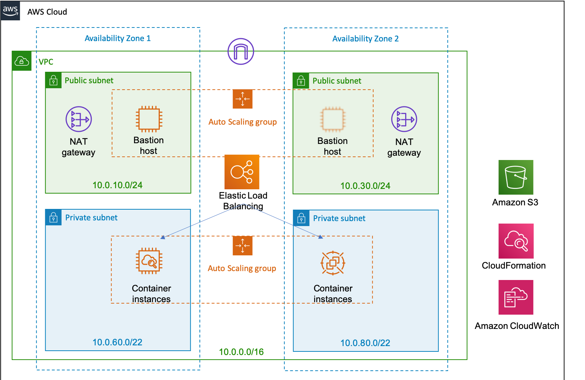

# Setup infrastructure layer & standup ECS

We're going to build the infrastructure as following achitecture diagram through CloudFormation templates.




## Prerequisite

- Install [jq](https://stedolan.github.io/jq/) and [git](https://git-scm.com/downloads).
- Install [AWS CLI](https://docs.aws.amazon.com/cli/latest/userguide/cli-chap-install.html) with latest version.
- [Configure](https://docs.aws.amazon.com/cli/latest/userguide/cli-chap-configure.html) AWS CLI with right permission.

## Playbook

### 1. Prepare enviroment

```bash

# setup variables
git clone https://github.com/aws-samples/ecs-mesh-workshop.git
cd ecs-mesh-workshop/bin
# modify environments in ./bashrc.ext
source ./bashrc.ext

# quick deployment, setup infrastructure & standup ECS cluster with on-demand instance
./install_all.sh

```

### 2. Run HelloWorld application

```bash

# register task
cd ecs-mesh-workshop/templates/ecs
aws ecs register-task-definition \
    --cli-input-json file://hello-world-task-definition.json

# run task as service
aws cloudformation --region $AWS_REGION describe-stacks \
  --stack-name $ECS_STACK_NAME \
  --query 'Stacks[0].Outputs[?OutputKey==`elbDns`].OutputValue' \
  --output text |awk '{print "ELB_DNS="$0}' >> tmp.env

aws cloudformation --region $AWS_REGION describe-stacks \
  --stack-name $ECS_STACK_NAME \
  --query 'Stacks[0].Outputs[?OutputKey==`ecsRole`].OutputValue' \
  --output text |awk '{print "ECS_ROLE_NAME="$0}' >> tmp.env

aws cloudformation --region $AWS_REGION describe-stacks \
  --stack-name $ECS_STACK_NAME \
  --query 'Stacks[0].Outputs[?OutputKey==`appElbTargetGroup`].OutputValue' \
  --output text |awk '{print "TARGET_GROUP_ARN="$0}' >> tmp.env

source ./tmp.env

sed -i -e "s/{target_group_arn}/$EC2_INSTANCE_ID/g" hello-world-service-definition.json
sed -i -e "s/{service_role}/$ECS_ROLE_NAME/g" hello-world-service-definition.json
aws ecs create-service \
    --cluster $ECS_CLUSTER_NAME  \
    --service-name hello-world-service1  \
    --cli-input-json file://hello-world-service-definition.json

```

### 3. Test HelloWorld application

```bash

# send request by curl
curl "http://$ELB_DNS/hello"
# see someting like - Hello (10.0.40.107)! - if success

```

### 4. Clean-up

```bash

# delete all stacks in CloudFormation
cd ecs-mesh-workshop/bin
./clean_up.sh

```
