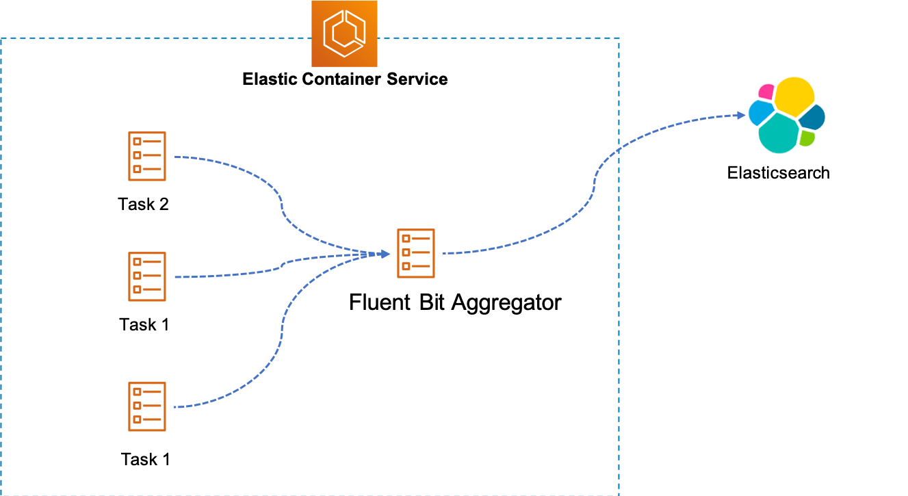

# Centralized log solution with Fluent Bit & Elasticsearch

[Fluent Bit](https://fluentbit.io/) is light weight logs processor compare to Fluentd and built by C. This session will leverage Fluent Bit and Elasticsearch to build centralized log solution, and here's high level architecture. 



This hands-on lab refer to many componnents, so be careful with all steps. 

## Prerequisite

- Install [jq](https://stedolan.github.io/jq/) and [git](https://git-scm.com/downloads).
- Install [AWS CLI](https://docs.aws.amazon.com/cli/latest/userguide/cli-chap-install.html) with latest version.
- [Configure](https://docs.aws.amazon.com/cli/latest/userguide/cli-chap-configure.html) AWS CLI with right permission.
- Create an [Amazon Elasticsearch domain](https://docs.aws.amazon.com/elasticsearch-service/latest/developerguide/es-gsg-create-domain.html), recommend [setup Amazon Cognito authentication for Kibana] (https://docs.aws.amazon.com/elasticsearch-service/latest/developerguide/es-cognito-auth.html#es-cognito-auth-config) for security.

## Playbook

### 1. Prepare enviroment

> Note: You can ignore this step if you finished previous module - [Using spot instance as worker nodes](./Spot4Worker.md) without clean-up!!!

```bash

# setup variables
cd ecs-mesh-workshop/bin;
# modify environments in ./bashrc.ext
source ./bashrc.ext

# quick deployment, setup infrastructure & standup ECS cluster with on-demand instance
./install_all.sh spot

```

### 2. Config access policy for Elasticsearch
We setup access to Elasticsearch through IAM user, create IAM user with programmatic access. Also make note of 'UserName', 'AccessKeyId', 'SecretAccessKey' from output.

```bash

aws iam create-user --user-name <user-name>
# {
#     "User": {
#         "Path": "/",
#         "UserName": "<user-name>",
#         "UserId": "AIDAXXF24YG2AR5DQNQEZ",
#         "Arn": "arn:aws:iam::<account_id>:user/<user-name>",
#         "CreateDate": "2019-08-31T03:13:18Z"
#     }
# }

aws iam create-access-key --user-name <user-name>
# {
#     "AccessKey": {
#         "UserName": "<user-name>",
#         "AccessKeyId": "******************************",
#         "Status": "Active",
#         "SecretAccessKey": "************************************",
#         "CreateDate": "2019-08-31T03:13:48Z"
#     }
# }

```

Modify the access policy of ES as following template:

```
{
  "Version": "2012-10-17",
  "Statement": [
    {
      "Effect": "Allow",
      "Principal": {
        "AWS": [
          "arn:aws:iam::<account_id>:user/cc"
        ]
      },
      "Action": "es:*",
      "Resource": "arn:aws:es:<aws-region>:<account_id>:domain/<es-domain>/*"
    }
  ]
}
``` 

### 3. Modify Fluent Bit definitions

Modify parameters in file - fluent-bit-task-definition.json, include {aws_account_id}, {aws_region}, {aws_access_key_id}, {aws_secret_access_key}, {es_endpoint}, with proper value.

### 3. Install Fluent Bit

Before go any futher, please [build your own Fluent Bit image](../fluentbit/README.md) with customized configration and push into ECR.

```bash
# register task
cd ecs-mesh-workshop/fluentbit
aws ecs register-task-definition --cli-input-json file://fluent-bit-task-definition.json

# launch deamon on container instances
aws ecs create-service \
    --cluster $ECS_CLUSTER_NAME \
    --cli-input-json file://fluent-bit-daemon.json

```

### 4. Check out logs & visualization in Kibana


### 5. Clean-up

De-prevision Elastic Service & ECR were created previously and run following scripts to delete remaining resources.

```bash

# delete service and task definition
aws ecs delete-service 
    --cluster $ECS_CLUSTER_NAME \
    --service fluentd-aggregator-daemon
aws ecs deregister-task-definition
    --task-definition fluentd-aggregator

# delete all stacks in CloudFormation
cd ecs-mesh-workshop/bin
./clean_up.sh

```