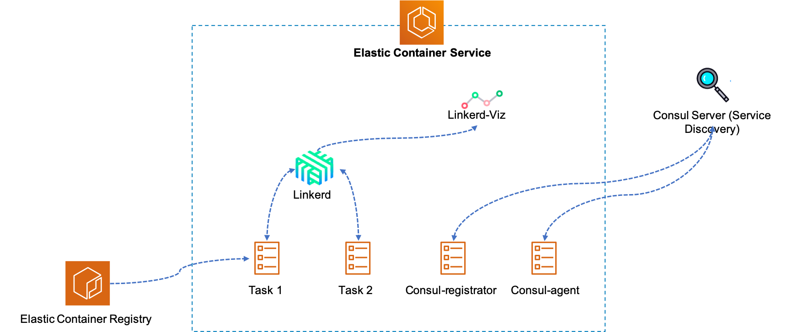

# Using third party solution for service mesh and monitoring

Using Linkerd, Prometheus, and Grafana as major components for service mesh and monitoring solution, and Consul for service discovery. We're going to install multiple example applications through following steps and monitoring in real-time. Here's a high level architecture diagram.



[Linkerd](https://linkerd.io/1/overview/) is an open source network proxy designed to be deployed as a service mesh: a dedicated layer for managing, controlling, and monitoring service-to- service communication within an application. 

[Prometheus](https://prometheus.io/docs/introduction/overview/) and [Grafana](https://grafana.com/grafana) are open-source systems monitoring and alerting toolkit. 

## Prerequisite

- Install [AWS CLI](https://docs.aws.amazon.com/cli/latest/userguide/cli-chap-install.html) with latest version.
- [Configure](https://docs.aws.amazon.com/cli/latest/userguide/cli-chap-configure.html) AWS CLI with right permission.

## Playbook

### 1. Prepare enviroment

```bash

# setup variables
cd ecs-mesh-workshop/bin
# modify environments in ./bashrc.ext
source ./bashrc.ext

# quick deployment, setup infrastructure & standup ECS cluster with on-demand instance
./install_all.sh spot


# build example applications
cd ecs-mesh-workshop/examples/todo/front
docker build -t todo-front .
cd ecs-mesh-workshop/examples/todo/store
docker build -t todo-store .

# push images to ECR
aws ecr create-repository --repository-name todo-front --image-tag-mutability MUTABLE
aws ecr create-repository --repository-name todo-store --image-tag-mutability MUTABLE
$(aws ecr get-login --no-include-email --region $AWS_REGION)
docker tag todo-front:latest $AWS_ACCOUNT_ID.dkr.ecr.$AWS_REGION.amazonaws.com.cn/todo-front:latest
docker push $AWS_ACCOUNT_ID.dkr.ecr.$AWS_REGION.amazonaws.com.cn/todo-front:latest

docker tag todo-store:latest $AWS_ACCOUNT_ID.dkr.ecr.$AWS_REGION.amazonaws.com.cn/todo-store:latest
docker push $AWS_ACCOUNT_ID.dkr.ecr.$AWS_REGION.amazonaws.com.cn/todo-store:latest

```

### 2. Linkerd & Consul Dashboard

Choose linkerd-viz-node and forward traffic on three local ports to
three remote ports on the EC2 host:

- Traffic to `localhost:9990` will go to the Linkerd dashboard on the remote
  host
- Traffic to `localhost:8500` will go to the Consul admin dashboard on the
  remote host
- Traffic to `localhost:4140` will go to the Linkerd HTTP proxy on the remote
  host

```bash
# select an ECS node
ECS_NODE=$( \
  aws ec2 describe-instances \
    --filters Name=instance-state-name,Values=running Name=tag:Name,Values=*linkerdviz-node  \
    --query 'Reservations[0].Instances[0].PublicDnsName' \
    --output text \
)

# don't stop this tunnel and will be used in step 4!!!
ssh -i "$KEY_PAIR" \
    -L 127.0.0.1:4140:$ECS_NODE:4140 \
    -L 127.0.0.1:9990:$ECS_NODE:9990 \
    -L 127.0.0.1:8500:$ECS_NODE:8500 ec2-user@$ECS_NODE -N

# view linkerd dashboard (osx)
open http://localhost:9990

# view Consul (osx)
open http://localhost:8500

```

### 3. Install example applications into ECS

```bash


# register example applications
cd ecs-mesh-workshop/templates/ecs
aws ecs register-task-definition --cli-input-json file://example-front-task-definition.json
aws ecs register-task-definition --cli-input-json file://example-store-task-definition.json
aws ecs register-task-definition --cli-input-json file://hello-world-mesh-task-definition.json

```

### 4. Test dynamic request routing

Lets use the tunnel to send some requests to the `helloworld` service via the
Linkerd HTTP proxy:

```bash
# run task
aws ecs run-task --cluster l5d-demo --task-definition hello-world --count 2

# test routing via Linkerd
http_proxy=localhost:4140 curl hello
```

You will see these requests reflected in the Linkerd dashboard. The request flow
we just tested:

`curl` -> `linkerd` -> `hello` -> `linkerd` -> `world`

As our `hello-world` task also included a `world-v2` service, let's test
per-request routing:

```bash
http_proxy=localhost:4140 curl -H 'l5d-dtab: /svc/world => /svc/world-v2' hello
```

By setting the `l5d-dtab` header, we instructed Linkerd to dynamically route all
requests destined for `world` to `world-v2`.

### 5. Monitoring wih Grafana & Prometheus through Linkerd

```bash
# register task & run
cd ./cf/ecs
aws ecs register-task-definition --cli-input-json file://linkerd-viz-task-definition.json
aws ecs run-task --cluster $ECS_CLUSTER_NAME --task-definition linkerd-viz --count 1

# find the ECS node running linkerd-viz
TASK_ID=$(  \
    aws ecs list-tasks --cluster $ECS_CLUSTER_NAME \
        --family linkerd-viz --desired-status RUNNING \
        --query taskArns[0] --output text
)
CONTAINER_INSTANCE=$(   \
    aws ecs describe-tasks --cluster $ECS_CLUSTER_NAME \
        --tasks $TASK_ID --query tasks[0].containerInstanceArn \
        --output text
)
INSTANCE_ID=$(  \
    aws ecs describe-container-instances --cluster $ECS_CLUSTER_NAME \
        --container-instances $CONTAINER_INSTANCE \
        --query containerInstances[0].ec2InstanceId \
        --output text
)
VIZ_NODE=$( \
    aws ec2 describe-instances --instance-ids $INSTANCE_ID \
        --query Reservations[*].Instances[0].PublicDnsName \
        --output text
)

ssh -i "$KEY_PAIR" -L 127.0.0.1:3000:$VIZ_NODE:3000 ec2-user@$VIZ_NODE -N

# view linkerd-viz (osx)
open http://localhost:3000

```

### 6. Clean-up

```bash

# delete all stacks in CloudFormation
cd ecs-mesh-workshop/bin
./clean_up.sh

```
